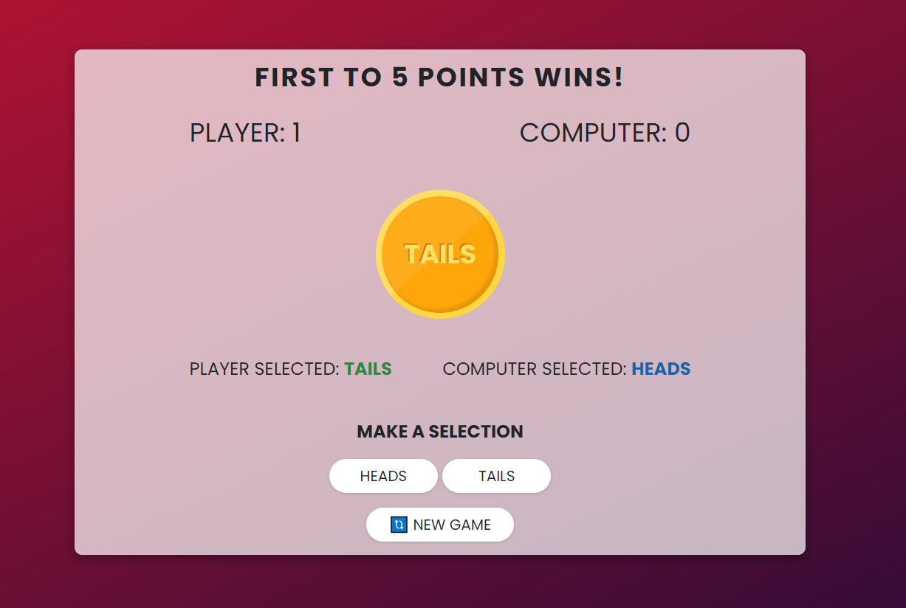

## Coin Toss Game
Coin tossing game between the user and the computer. The first one to reach 5 points wins or draw if both reach 5 points. Made to practice some functional programming (closures, composing with the help of Ramda library, immutability, etc.)

## Technologies used
- HML
- CSS
- JavaScript
- Animate.css
- Ramda v0.28

## Quick preview
You can check out the app here:
<a href="https://coin-toss-game.netlify.app/" target="_blank">Coin Toss Game</a> 
(WARNING: Opens in the same tab)
